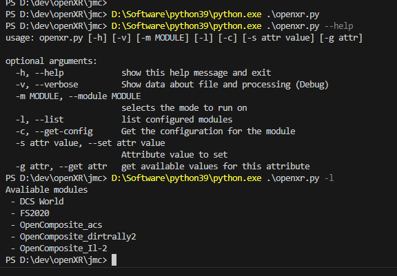

# PyOpenXR-Toolkit-Config

This program stores/saves the configuration from the [OpenXR-Toolkit](https://github.com/mbucchia/OpenXR-Toolkit) and let's you change the options **before** starting the game
(it's very useful if you use a WMR VR kit, so you save one session reload to get the changes on)
Configures some registry options from command line, so you don't need to start the app, then open the [OpenXR-Toolkit](https://github.com/mbucchia/OpenXR-Toolkit) and restart the session.

## How to install

You need `pywin32` module (`pip install pywin32`) as dependency.

## Registry keys:

* `Computer\HKEY_LOCAL_MACHINE\SOFTWARE\OpenXR_Toolkit` Application config (key bindings, safe mode)
* `Computer\HKEY_CURRENT_USER\SOFTWARE\OpenXR_Toolkit` Per module (e.g. game) configuration

## Software definitions

All the enum definitions and values are extracted from Mbucchia's code: [OpenXR-Toolkit/XR_APILAYER_MBUCCHIA_toolkit/interfaces.h](https://github.com/mbucchia/OpenXR-Toolkit/blob/main/XR_APILAYER_MBUCCHIA_toolkit/interfaces.h)

## Usage

### List modules 
</img> 

### Get Module configuration
</img> 

### Get attribute values
</img> 

### Set turbo value
</img> 

